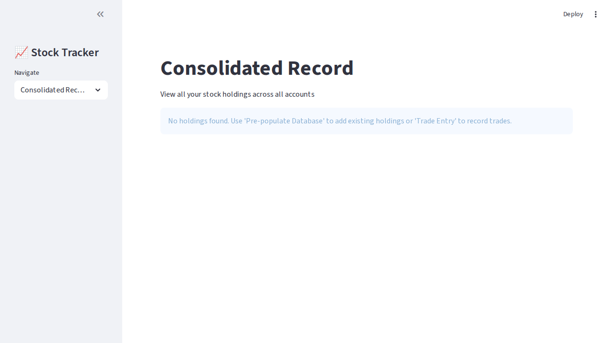

# Streamlit Stock Tracker - Design Review & Ratings

## Overview
Comprehensive design review of all 5 pages in the Stock Tracker application, based on code analysis and visual assessment.

---

## 1. Consolidated Record (Dashboard) - Rating: 7/10

### Screenshot Analysis


### Strengths:
- **Clean Empty State**: Clear messaging ("No holdings found...") with actionable guidance
- **Logical Layout**: Good use of sidebar navigation with clear page title
- **Branding**: Icon (📈) + "Stock Tracker" provides visual identity
- **Information Architecture**: Subtitle explains the page purpose clearly

### Code Review (Lines 298-369):
- **Metrics Dashboard** (4 columns): Total Holdings, Total Shares, Total Value, Total Gain/Loss
- **Filtering System**: Two-column filter layout for Account and Stock Symbol
- **Data Table**: Formatted display with renamed columns for clarity
- **Responsive**: Uses Streamlit's column system effectively

### Areas for Improvement:
1. **Empty State Could Be More Visual**: Add an illustration or icon for the empty state
2. **Metric Cards Spacing**: Consider adding visual separators between metrics
3. **No Data Visualization**: When data exists, consider adding a pie chart or bar chart for portfolio allocation
4. **Color Coding Missing**: Gain/Loss should be color-coded (green for positive, red for negative)
5. **Loading States**: No loading indicators when fetching data

### Recommendations:
- Add `delta` parameter to metrics for Gain/Loss to show trend
- Include a visual chart/graph when holdings exist
- Consider adding exportable report functionality
- Add date range filter for acquisition dates

---

## 2. Trade Entry - Rating: 6.5/10

### Code Review (Lines 371-594):

### Strengths:
- **Smart Stock Symbol Resolution**: Auto-resolves TSX symbols (tries .TO first)
- **Contextual UX**: Different inputs for Buy vs Sell/Transfer (dropdown for sells)
- **Preview Feature**: Sell trades have a "Preview" button (lines 479-533) - excellent UX
- **Validation**: Comprehensive input validation with clear error messages
- **Form State Management**: Proper use of session state for form inputs
- **Available Shares Display**: Shows max shares when selling/transferring

### Code Analysis Highlights:
```python
# Smart validation (lines 543-554)
if not account.strip():
    st.error("Please enter an account name.")
elif trade_type in ["S", "T"] and not stock_symbol.strip():
    st.error("Please select a stock to sell/transfer.")
# ... comprehensive validation
```

### Areas for Improvement:
1. **Form Layout**: Single-column form could be more compact
2. **No Visual Feedback**: Success/error messages could be more prominent
3. **Limited Help Text**: Could add more contextual help for new users
4. **No Trade Summary**: After successful trade, show a summary card
5. **Commission Default**: $9.99 default may not fit all brokers
6. **No Keyboard Shortcuts**: Power users would benefit from shortcuts

### Recommendations:
- Add a "Recent Trades" widget at the bottom
- Include a running total calculator showing trade value
- Add preset commission amounts (e.g., $0, $4.99, $9.99)
- Consider adding a "Clear Form" button
- Show real-time stock price if Buy trade (from yfinance)

---

## 3. Pre-populate Database - Rating: 6/10

### Code Review (Lines 596-671):

### Strengths:
- **Clear Purpose**: Straightforward interface for adding existing holdings
- **Auto-calculated Fields**: Shows "Cost per Share" calculation (lines 631-634)
- **Symbol Resolution**: Same smart TSX symbol resolution as Trade Entry
- **Form Validation**: Good validation for required fields
- **Account Reuse**: Dropdown of existing accounts for consistency

### Code Structure:
```python
# Nice touch: calculated metric display
if quantity and quantity > 0 and book_cost > 0:
    cost_per_share = book_cost / int(quantity)
    st.metric("Cost per Share", format_currency(cost_per_share))
```

### Areas for Improvement:
1. **No Bulk Import**: Should allow CSV upload for multiple holdings
2. **Limited Guidance**: No explanation of what "Book Cost" means
3. **No Confirmation**: After adding, user doesn't see what was added
4. **Integer Quantity Only**: Might need fractional shares support
5. **No Edit/Delete**: Can't modify pre-populated entries
6. **Single Entry Flow**: Tedious for many holdings

### Recommendations:
- Add CSV import feature with template download
- Include field tooltips/help text
- Show a success summary with option to add another
- Add table showing recently pre-populated items
- Consider wizard-style flow for first-time setup
- Add "Duplicate Entry" button for similar holdings

---

## 4. Trade History - Rating: 7.5/10

### Code Review (Lines 673-752):

### Strengths:
- **Excellent Filtering**: 3-column filter layout (Account, Symbol, Type)
- **Summary Statistics**: Bottom summary with Total Trades, Shares, Commission
- **Trade Type Formatting**: Maps B/S/T to readable "Buy/Sell/Transfer"
- **Date Formatting**: Consistent date display
- **Clear Table**: Well-renamed columns for readability
- **Empty State**: Clear message when no trades exist

### Code Highlights:
```python
# Good filter implementation (lines 684-708)
col1, col2, col3 = st.columns(3)
# Three filters: Account, Symbol, Type
# Format function for trade types
format_func=lambda x: {"All": "All", "B": "Buy", "S": "Sell", "T": "Transfer"}[x]
```

### Areas for Improvement:
1. **No Date Range Filter**: Can't filter by date
2. **No Export**: Should allow exporting to CSV/Excel
3. **No Trade Details**: Clicking a trade doesn't show more info
4. **No Sorting**: Can't sort by different columns
5. **No Search**: Can't search within trades
6. **Missing Visualization**: No chart showing trade activity over time

### Recommendations:
- Add date range picker for filtering
- Include export to CSV button
- Add trade activity timeline chart
- Show net shares bought/sold per stock
- Add click-to-expand for trade details
- Include pagination for large datasets
- Add "Delete Trade" functionality (with confirmation)

---

## 5. Stock Charts - Rating: 8/10

### Code Review (Lines 754-944):

### Strengths:
- **Beautiful Chart Design**: Custom color scheme and fonts (lines 18-35)
- **Interactive Charts**: Plotly integration with hover tooltips
- **Multiple Timeframes**: 9 different timeframe options
- **Price + Volume**: Two charts showing complementary data
- **Portfolio Performance**: Real-time calculations with unrealized gains
- **Stock Information**: Market cap, P/E ratio, dividend yield, beta
- **Portfolio Overview**: Pie chart showing allocation
- **Responsive Metrics**: 4-column metric layout
- **Caching**: Smart use of @st.cache_data (lines 786)

### Code Highlights:
```python
# Excellent chart styling (lines 172-227)
def create_price_chart(data, symbol, stock_name, timeframe):
    # Smooth lines with spline
    line=dict(color=CHART_COLORS['primary'], width=3,
              shape='spline', smoothing=0.3)
    # Area fill
    fill='tonexty', fillcolor=CHART_COLORS['primary_transparent']
```

### Chart Theme (lines 18-35):
- Professional color palette (#4A90E2 blue)
- Consistent font sizing
- Clean, modern aesthetics

### Areas for Improvement:
1. **No Comparison**: Can't compare multiple stocks
2. **Limited Technical Indicators**: No moving averages, RSI, etc.
3. **No Drawing Tools**: Can't annotate charts
4. **Performance**: Multiple API calls could be slow
5. **No Alerts**: Can't set price alerts
6. **Static Portfolio Overview**: Doesn't update in real-time

### Recommendations:
- Add stock comparison mode (overlay multiple stocks)
- Include basic technical indicators (MA, RSI, MACD)
- Add candlestick chart option
- Show cost basis line on chart
- Add buy/sell markers from trade history
- Include % gain/loss on each holding in portfolio overview
- Add refresh button for latest prices
- Consider WebSocket for real-time updates

---

## Overall Application Rating: 7/10

### Global Strengths:
1. **Consistent Design Language**: Similar layouts across pages
2. **Smart Features**: TSX symbol resolution, preview trades
3. **Good Code Organization**: Helper functions, consistent formatting
4. **Responsive Layout**: Proper use of columns and containers
5. **Data Validation**: Comprehensive error handling

### Global Areas for Improvement:
1. **No Dark Mode**: Only light theme available
2. **Limited Accessibility**: Missing ARIA labels, keyboard nav
3. **No Mobile Optimization**: Wide layout not ideal for mobile
4. **No User Preferences**: Can't save settings
5. **No Backup/Restore**: No data export/import
6. **No Multi-user Support**: Single user application
7. **Limited Error Recovery**: No undo functionality
8. **No Documentation**: No in-app help or tooltips

### Priority Improvements (High Impact):
1. **Add CSV Import/Export** across all pages
2. **Implement Dark Mode** for better accessibility
3. **Add Color Coding** for gains/losses (green/red)
4. **Include Date Range Filters** on History and Charts
5. **Add Loading Indicators** during data fetches
6. **Implement Toast Notifications** for better feedback
7. **Add Confirmation Dialogs** for destructive actions
8. **Include Keyboard Shortcuts** for power users

### Design Excellence Points:
- Chart styling is professional and polished
- Form validation is thorough
- Empty states are well-handled
- Code is clean and maintainable

---

## Page Rankings (Best to Improve):
1. **Stock Charts** (8/10) - Most polished, great visualizations
2. **Trade History** (7.5/10) - Excellent filtering and summary
3. **Consolidated Record** (7/10) - Solid dashboard, good metrics
4. **Trade Entry** (6.5/10) - Good functionality, needs UI polish
5. **Pre-populate Database** (6/10) - Basic, needs bulk operations

---

## Next Steps:
1. Implement high-priority improvements listed above
2. Add comprehensive testing suite
3. Create user documentation
4. Consider progressive web app (PWA) features
5. Add data backup/restore functionality
6. Implement error tracking and analytics
